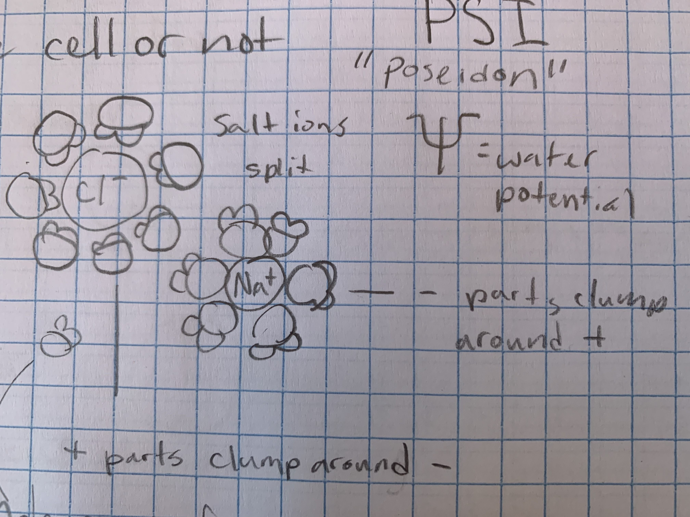

# Water Potential
### Water Potential - Potential energy of water per unit area compared to pure water
* Allows us to figure out where water will go
* *will water flow in the cell or not*

### ψ = ψs + ψp
ψ - water potential

ψs - solute potential

ψp- pressure potential

Pure Water is 0 bars. It always flows from high to low concentration/High water potential 
to low water potential.

ψs drops as solute increases

### Water Potential Gradient
example - tree

Atmosphere -1000 bars

Leaves -15 bars

Stems -6 bars

Roots -2 bars

distilled water 0 bars

** **goes upward ^**

### ψs

ψs = -ICRT

I = Ionisation Constant

C = Concentration (Moles)

R = Pressure Constant - always .0831

T = Temperature in Kelvin *temp in C + 273